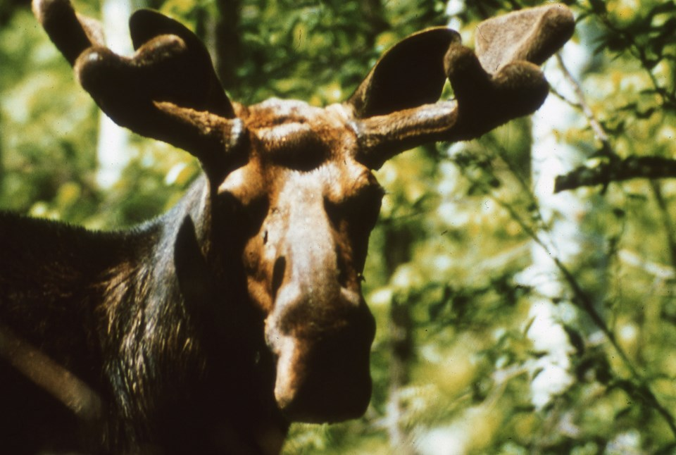

<h2>The Population Biology of Isle Royale Wolves and Moose</h2>

    <a href="index.md" style="color: white; text-decoration: none; display: block; padding: 20px 0;">Home</a>
    <a href="overview.md" style="color: white; text-decoration: none; display: block; padding: 10px 0;">Overview</a>
    <a href="population_time.md" style="color: white; text-decoration: none; display: block; padding: 10px 0;">Population vs Time</a>
    <a href="temparature_population.md" style="color: white; text-decoration: none; display: block; padding: 10px 0;">Temperature vs Population</a>
    <a href="lotka_voltera.md" style="color: white; text-decoration: none; display: block; padding: 10px 0;">Lotka Volterra</a>
    <a href="source.md" style="color: white; text-decoration: none; display: block; padding: 10px 0;">Sources</a>
    <a href="about_us.md" style="color: white; text-decoration: none; display: block; padding: 10px 0;">About Us</a>

    <!-- Background Image -->
    

<table>
  <tr>
    <!-- Left Column: Image -->
    <td style="width: 50%; text-align: center;">
      
    </td>
    <!-- Right Column: Centered Text -->
    <td style="width: 50%; text-align: center; vertical-align: middle;">
      <h2>Introduction</h2>
      
The predator-prey dynamics of the Isle Royale ecosystem, specifically the interactions between wolves and moose, provide an opportunity to study population fluctuations in a closed environment. Since the 1950’s, researchers have collected data on the populations of these two species. Understanding patterns of population growth, decline, and recovery is crucial for predicting the long-term stability of the systems and can offer insights into the broader field of ecosystem management and conservation. 
.

    </td>
  </tr>
</table>
